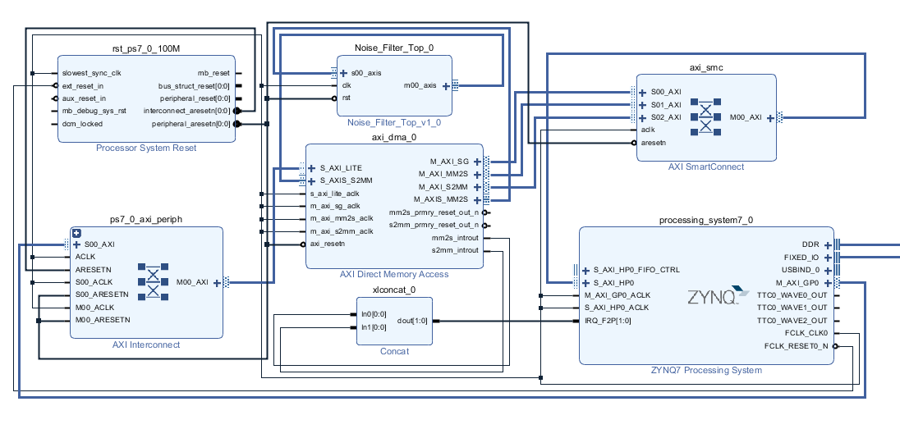

# AXI_digital_median_filter_IP

it is an image filter IP core based on Xilinx ZYNQ SOC, Using hardware 3x3 median filter to eliminate image salt-and-pepper noise without CPU involvement. 

a possible usage diagram can be as following, and this design is the "Digital Image Filter" model in the following diagram

Figure 1: overview diagram of final system

Processing System (PS) side is reponsible to transmit and receive image data via DMA channels. A hardware digital image filter is done in Programmable Logic (PL) side. Direct memory access (DMA) channels are established for high speed data exchange between PS side and PL side. 

for establishing a environment for this IP code,first of all, we can use “AXI4-Stream Data FIFO” IP (provided by Vivado) to replace this IP, to check DMA channels. we must make sure DMA channels (read and write) can run properly first, then replace the “AXI4-Stream Data FIFO” IP into this median filter IP.
so, privious diagram can be changed into following diagram first

Figuire 2: diagram of replacing the “Digital Image Filter” IP for checking DMA channels communication

PL side hardware diagram design procedure in Vivado can refer to http://www.fpgadeveloper.com/2014/08/using-the-axi-dma-in-vivado.html
in “AXI Direct Memory Access” IP setting,	Make sure “Enable Scatter Gather Engine” is checked
the diagram will looks like following:

Figuire 3: hardware diagram in Vivado

I am not going to talk about how to establish the environment in PS side. But in short, the following files are required:
•	BOOT.BIN (boot image, contains First Stage Boot Loader (FSBL), bitstream and u-boot.elf)
•	devicetree.dtb (device tree)
•	uImage (Linux kernel)
•	Linux file system 
some useful links: 
 https://github.com/Xilinx/u-boot-xlnx
 https://github.com/Xilinx/device-tree-xlnx
 https://github.com/Xilinx/linux-xlnx or https://gitlab.pld.ttu.ee/Karl.Janson/xilinx_linux.git
 https://rcn-ee.com/rootfs/eewiki/minfs/
 
Linux OS is not compulsory, just make sure that you can use PS side to transfer and receive data with DMA channels, that's fine! such as using SDK is also possible.
 
for Linux OS, some very good C DMA channel driver and example programs are provide in here :
https://github.com/bperez77/xilinx_axidma (Link 1)
it also explains how to make necessary files, especially it explains the device tree.

a chinese website : https://blog.csdn.net/long_fly/article/details/80482248  also very useful. it explains how to establish Linux OS in PS side and how to use the DMA channel driver and example in (Link 1) step by step, very easy to understand.

until now, if you can use the "axidma_benchmark" in (Link 1) and get the result similar with following:

Figure 4: running result of “axidma_benchmark”

# LICENSE

MIT License

Copyright (c) 2019 miaoyangpeng <miaoyangpeng@gmail.com>

Permission is hereby granted, free of charge, to any person obtaining a copy
of this software and associated documentation files (the "Software"), to deal
in the Software without restriction, including without limitation the rights
to use, copy, modify, merge, publish, distribute, sublicense, and/or sell
copies of the Software, and to permit persons to whom the Software is
furnished to do so, subject to the following conditions:

The above copyright notice and this permission notice shall be included in all
copies or substantial portions of the Software.

THE SOFTWARE IS PROVIDED "AS IS", WITHOUT WARRANTY OF ANY KIND, EXPRESS OR
IMPLIED, INCLUDING BUT NOT LIMITED TO THE WARRANTIES OF MERCHANTABILITY,
FITNESS FOR A PARTICULAR PURPOSE AND NONINFRINGEMENT. IN NO EVENT SHALL THE
AUTHORS OR COPYRIGHT HOLDERS BE LIABLE FOR ANY CLAIM, DAMAGES OR OTHER
LIABILITY, WHETHER IN AN ACTION OF CONTRACT, TORT OR OTHERWISE, ARISING FROM,
OUT OF OR IN CONNECTION WITH THE SOFTWARE OR THE USE OR OTHER DEALINGS IN THE
SOFTWARE.
