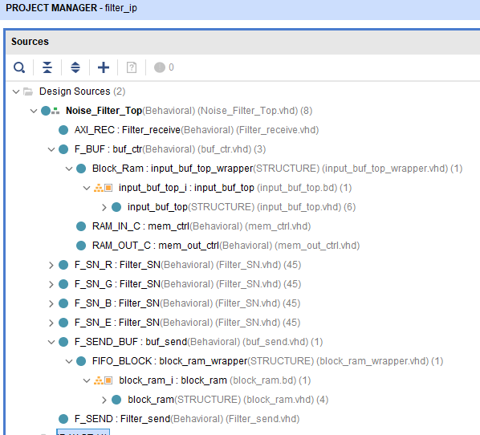
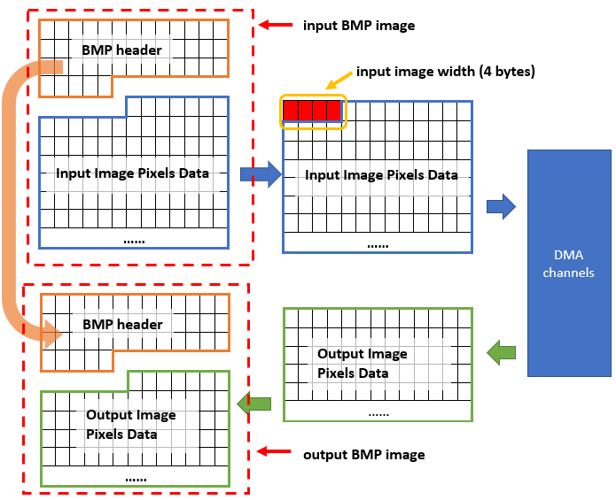

# AXI_digital_median_filter_IP

## Overview
it is an image filter IP core based on Xilinx ZYNQ SOC, Using hardware 3x3 median filter to eliminate image salt-and-pepper noise without CPU involvement. 

a possible usage diagram can be as following, and this design is the "Digital Image Filter" model in the following diagram

 
Figure 1: overview diagram of final system

Processing System (PS) side is reponsible to transmit and receive image data via DMA channels. A hardware digital image filter is done in Programmable Logic (PL) side. Direct memory access (DMA) channels are established for high speed data exchange between PS side and PL side. 

**the structure and working principle of this IP core will be explain at the end of this file.**
**every VHDL file name and block design name can not fully stand for its funtion, please refer to the "Design Name" in the beginning of each file**

## Establishing DMA channels communication environment

### PL

for establishing a environment for this IP code,first of all, we can use “AXI4-Stream Data FIFO” IP (provided by Vivado) to replace this IP, to check DMA channels. we must make sure DMA channels (read and write) can run properly first, then replace the “AXI4-Stream Data FIFO” IP into this median filter IP.
so, privious diagram can be changed into following diagram first

 
Figuire 2: diagram of replacing the “Digital Image Filter” IP for checking DMA channels communication

PL side hardware diagram design procedure in Vivado can refer to http://www.fpgadeveloper.com/2014/08/using-the-axi-dma-in-vivado.html
in “AXI Direct Memory Access” IP setting,	Make sure “Enable Scatter Gather Engine” is checked
the diagram will looks like following:
 
Figuire 3: hardware diagram in Vivado

### PS

I am not going to talk about how to establish the environment in PS side. But in short, the following files are required:
•	BOOT.BIN (boot image, contains First Stage Boot Loader (FSBL), bitstream and u-boot.elf)
•	devicetree.dtb (device tree)
•	uImage (Linux kernel)
•	Linux file system 
some useful links: 
 https://github.com/Xilinx/u-boot-xlnx
 https://github.com/Xilinx/device-tree-xlnx
 https://github.com/Xilinx/linux-xlnx or https://gitlab.pld.ttu.ee/Karl.Janson/xilinx_linux.git
 https://rcn-ee.com/rootfs/eewiki/minfs/
 
Linux OS is not compulsory, just make sure that you can use PS side to transfer and receive data with DMA channels, that's fine! such as using SDK is also possible.
 
for Linux OS, some very good C DMA channel driver and example programs are provide in here :
https://github.com/bperez77/xilinx_axidma (Link 1)
it also explains how to make necessary files, especially it explains the device tree.

a chinese website : https://blog.csdn.net/long_fly/article/details/80482248  also very useful. it explains how to establish Linux OS in PS side and how to use the DMA channel driver and example in  step by step, very easy to understand.

### result

until now, if you can use the "axidma_benchmark" in  and get the result similar with following result, means your DMA channels communication environment can run properly:
 
Figure 4: running result of “axidma_benchmark”

 “axidma_transfer” is another very useful program. Its function is to transfer a file to DMA channel, and receive data from DMA channel as well. It will write the received into a file. like following:
 
Figure 5: usage example of “axidma_transfer”
you can use "diff" command to check if the received file is total the same as the original file or not.

## Using this image filter IP
in this section, you can replace the “AXI4-Stream Data FIFO” IP in figure 3 into this "Digital Image Filter" IP. 
for finishing this task, you should create a new Vivado project first, and add all VHDL files in Root directory, receive_buf, send_buf and sorting_network. and add two block design diagram, "input_buf_top" folder and "block_ram" folder (should add the whole folder). “Generate output products” and “create HDL wrapper” for both block design diagrams. the final project structure is illustrate in the following image:
 
Figure 6: IP source structure 
and then, package it as a new IP and replce the “AXI4-Stream Data FIFO” IP in figure 3.

## make a C program for doing image median filtering 

for letting the can do image median filtering function, first, you need to transfer the image into .BMP format, AS .bmp format is not compress.
then is the operation like the following image

 

you can do the DMA transmit and receive by “axidma_transfer” in the  mentioned above. 

you can do the cutting header operation by modify “axidma_transfer.c” and "util.c" files, or do you by hand.

## structure and working principle of this image filter IP

Figure 7 shows the basic structure about the Digital Image Filter IP. As this IP core receives data from “AXI DMA” IP and needs to send data back to DMA channel through “AXI DMA” IP as well, Digital Image Filter IP must be compatible with AXI4-stream protocol. “AXI receiver” and “AXI sender” models are responsible for the compatibility.

When DMA channel’s data arrived, “AXI receiver” will setup relevant signals and start to receive DMA data. Necessary DMA data will be extracted by “AXI receiver” and deliver to DATA input BUFFER. “AXI sender” is for transmitting the result. 

The task of “DATA input BUFFER” is to storage at least three lines image pixel data. And distribute those data to Sorting Networks. There are four same “Sorting Network” are used and all working in pipe line. As the DMA data width is 32-bit, which means “DATA input BUFFER” will receive 4 bytes data in each clock cycle during data transmission. But each image pixel has only 3 bytes (red, green and blue). To make sure the system can run in highest speed, one extra Sorting Network is used.

Figure 8 shows the basic working principle about “DATA input BUFFER”. If the extra Sorting network has been used, then the next operation will be like Figure 9. After the operation of the third line of input image, the fourth line data of image will go to the first line storage place in “DATA input BUFFER”, and so on. Figure 10 is an example. 

The output of Sorting Networks’ data will go to an output FIFO. This FIFO will receive and assemble those 8-bit data, deliver them to “AXI sender” in 32-bit format.

 
Figure 7: basic structure about the image filter IP core

 
Figure 8: working principle of “DATA input BUFFER”

 
Figure 9: “DATA input BUFFER” next operation after Figure 8

 
Figure 10: “DATA input BUFFER” after filling the third line, the fourth line pixel data of input image will go to BUFFER first line

# LICENSE

MIT License

Copyright (c) 2019 miaoyangpeng <miaoyangpeng@gmail.com>

Permission is hereby granted, free of charge, to any person obtaining a copy
of this software and associated documentation files (the "Software"), to deal
in the Software without restriction, including without limitation the rights
to use, copy, modify, merge, publish, distribute, sublicense, and/or sell
copies of the Software, and to permit persons to whom the Software is
furnished to do so, subject to the following conditions:

The above copyright notice and this permission notice shall be included in all
copies or substantial portions of the Software.

THE SOFTWARE IS PROVIDED "AS IS", WITHOUT WARRANTY OF ANY KIND, EXPRESS OR
IMPLIED, INCLUDING BUT NOT LIMITED TO THE WARRANTIES OF MERCHANTABILITY,
FITNESS FOR A PARTICULAR PURPOSE AND NONINFRINGEMENT. IN NO EVENT SHALL THE
AUTHORS OR COPYRIGHT HOLDERS BE LIABLE FOR ANY CLAIM, DAMAGES OR OTHER
LIABILITY, WHETHER IN AN ACTION OF CONTRACT, TORT OR OTHERWISE, ARISING FROM,
OUT OF OR IN CONNECTION WITH THE SOFTWARE OR THE USE OR OTHER DEALINGS IN THE
SOFTWARE.
